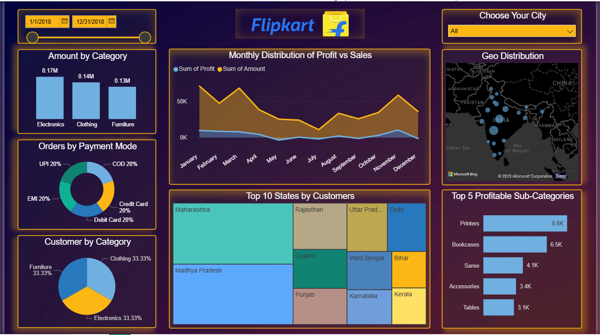

# Flipkart Sales & Profit Dashboard (Power BI)

**Author:** Pratham Hegde  
**Project:** Flipkart Sales Analysis dashboard built in Power BI.  
**Date:** 30 Nov 2025

---

## Preview

---

## About
A Power BI dashboard analyzing Flipkart orders & customer data — category sales, monthly profit vs sales, geo-distribution, payment modes, top states and profitable sub-categories.

---

## Files
- `Flipkart_Dashboard.pbix` — Power BI file (download link: https://drive.google.com/drive/folders/1TpK2tQ6R4IwijA6w9moGzEZkRCI73njO?usp=drive_link)  
- `images/dashboard.png` — preview screenshot  
- `README.md` — this file

---

## Dataset
Source (used to build the dashboard):  
https://drive.google.com/drive/folders/1iMpZKG0AIRT9I8RiGx1-nv2HJgsGNx_o?usp=drive_link

---

## How to open the dashboard
1. Download `Flipkart_Dashboard.pbix` (from Drive or repo).  
2. Open in **Power BI Desktop** (latest version recommended).  
3. If dataset is not included, place the CSV files in a folder and re-link data sources (or use provided sample data).

---

## Notes
- If `.pbix` is large, download it from Google Drive (link above).  
- You can modify visuals or replicate the dashboard using the dataset.

---

## Contact

Built by Pratham Hegde — find my LinkedIn: [www.linkedin.com/in/pratham-hegde-2472b2287]
